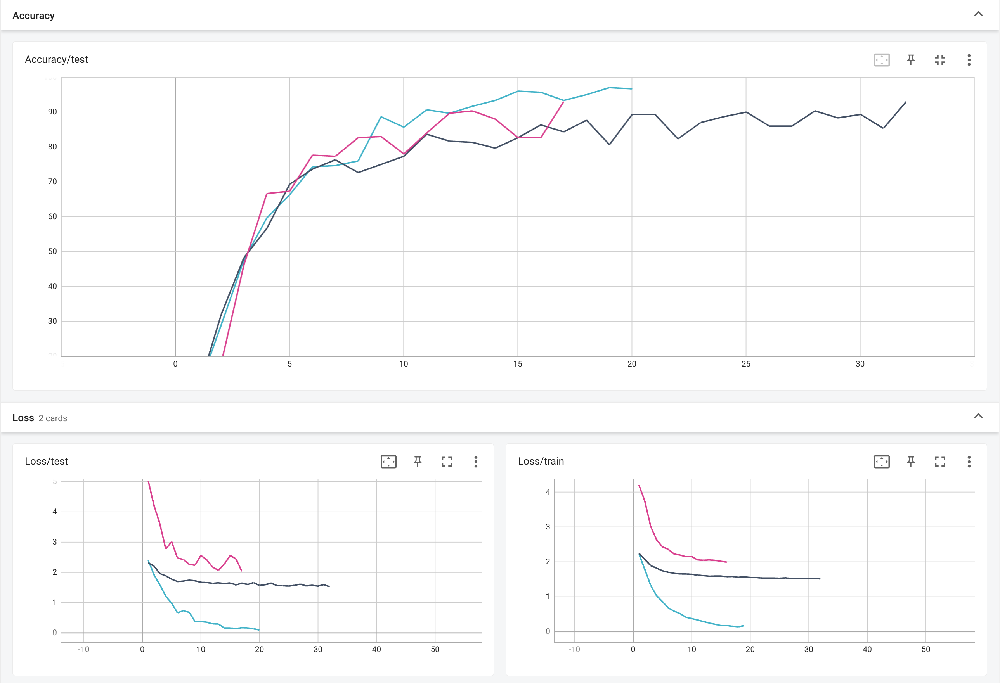

**AUDIO SPECTOGRAM TRANSFORMER** 

[Source](https://arxiv.org/abs/2104.01778)

****

Torch implementation of ***[ViT](https://arxiv.org/abs/2010.11929)*** based classifier which achieved **97%** accuracy on Audio [FSDD](https://github.com/Jakobovski/free-spoken-digit-dataset.git) dataset.

|  ViT Audio Classifier (acc 97%) |
| -------------------------------------------------------------------------------------------- |
|  Resnet Audio Classifier (93%) |
|  Resnet with PolyLoss (93%)    |

Check other branches for the comparison with **Resnet** and **Resnet + [Polyloss](https://arxiv.org/abs/2204.12511?context=cs)** code
